# PATENT COOPERATION TREATY (PCT) — INTERNATIONAL APPLICATION — DRAFT

**Title of the invention:** OIL-IN-WATER NANOEMULSION OF OZONATED OLIVE OIL STABILISED BY A LECITHIN–POLYSORBATE 80 SURFACTANT SYSTEM, PROCESS FOR ITS PREPARATION BY MICROFLUIDIZATION, AND USES THEREOF

**Draft status:** Working draft v0.1 prepared for review by a registered patent attorney before filing. Bracketed items marked [DRAFTING NOTE] require applicant input or confirmation. This draft follows the structure recommended for the PCT description (WIPO Administrative Instructions, Section 204): Technical Field, Background Art, Disclosure of Invention, Brief Description of Drawings, Mode(s) for Carrying Out the Invention, Industrial Applicability, followed by Claims, Abstract and Drawings. Paragraphs of the description are numbered consecutively in accordance with the Common Application Format.

| Bibliographic item | Entry |
|---|---|
| Applicant | [DRAFTING NOTE: Dalipharma / Ozan Fidan — confirm legal entity, address, nationality and residence] |
| Inventor(s) | Ozan Fidan [DRAFTING NOTE: confirm co-inventors, if any] |
| Priority claim | [DRAFTING NOTE: none identified; if a national first filing is made, insert number and date] |
| Receiving Office | [DRAFTING NOTE: e.g. RO/US, RO/TR or RO/IB depending on applicant residence] |
| International Searching Authority | [DRAFTING NOTE: e.g. EPO or USPTO] |
| Experimental basis | Microfluidizer trials 29 July – 3 August 2026 (tests 20260729A, 20260729B, 20260729C, 20260730A, 20260803A, 20260803B); laser diffraction (Horiba LA-950) and dynamic light scattering (Malvern Nano-S) data |

<<<PAGEBREAK>>>

# DESCRIPTION

## TECHNICAL FIELD

[0001] The present invention relates to the field of pharmaceutical, nutraceutical and cosmetic formulation. More particularly, the invention relates to an oil-in-water (O/W) nanoemulsion in which the dispersed oil phase is an ozonated vegetable oil, preferably ozonated extra virgin olive oil, stabilised by a binary surfactant system consisting of a phospholipid emulsifier (lecithin) and a polyoxyethylene sorbitan fatty acid ester (polysorbate 80). The invention further relates to a process for preparing said nanoemulsion by high-pressure microfluidization using a fixed-geometry interaction chamber, to a quality control strategy for said process, and to the use of the nanoemulsion for topical application to skin and mucosa and for oral administration as a food supplement.

## BACKGROUND ART

[0002] Ozonated vegetable oils are obtained by bubbling ozone (O3) through unsaturated vegetable oils. Ozone adds across the carbon–carbon double bonds of the unsaturated fatty acid residues according to the Criegee mechanism, forming 1,2,4-trioxolanes (ozonides), together with aldehydes, hydroperoxides and carboxylic acids. These oxygenated species are responsible for the antimicrobial, antifungal, anti-inflammatory and wound-healing properties attributed to ozonated oils. Ozonated olive oil, in particular, has been used for decades in topical dermatological and dental applications and is commercially available in several countries as a cosmetic and medical-device ingredient.

[0003] Despite their therapeutic interest, ozonated oils present three technical problems that have limited their formulation. First, they are water-immiscible, viscous and poorly spreadable, which restricts their use to anhydrous ointments, gels and bulk oil. Second, their lipophilicity results in low bioavailability of the active ozonides across hydrated biological barriers such as the stratum corneum and the gastrointestinal mucosa. Third, the ozonide and peroxide functional groups are thermolabile and sensitive to light, moisture and transition-metal ions, so that conventional heat-based or water-rich processing degrades the active species. US 9,554,973 B2 (micro-encapsulation of ozonated oils for oral-care articles) expressly notes that water-based emulsions of ozonated oils require evaluation because ozonides degrade in the presence of water, thereby teaching away from aqueous emulsion systems of ozonated oils.

[0004] Several documents describe the production of ozonated olive oil itself. WO 2019/102387 A1 (and its US counterpart US 11,236,289 B2) describes a method for producing an ozonized olive oil with a controlled degree of ozonization, characterised by the formation of peroxides, hydroperoxides and ozonides. EP 2 025 740 A1 describes a process for making an ozonised olive oil gel using at least 17 g of ozone per 100 g of extra virgin olive oil having a free oleic acid content not greater than 0.8%. GB 2 431 581 A describes ozonated oil formulations in which olive oil is ozonated to saturation for pharmaceutical and cosmetic use. US 2006/0074129 A1 describes a method in which a water-in-oil emulsion (1–50% by volume of water) of a vegetable oil is itself ozonated. DE 20 2004 021 089 U1 describes an ozone-stabilised olive and castor oil blend to which 5–25% by volume of non-ozonated oil is added and which is homogenised under pressure for the treatment of gingival inflammation. KR 2017/0057515 A describes a method for producing an ozonated olive cream using micro ozone bubbles. None of these documents discloses an oil-in-water nanoemulsion of ozonated olive oil with a droplet size below 250 nm, nor a lecithin–polysorbate 80 surfactant system, nor a high-pressure microfluidization process.

[0005] WO 2020/070623 A1 (also published as IT 2018/00009063 A1 and BR 11 2021 005972 A2) addresses the water dispersibility of ozonised oil by adsorbing the oil onto silica, for the controlled release of the oil in the treatment of tumours; this is a solid carrier approach and not a liquid nanoemulsion.

[0006] WO 2019/240713 A2 ("Solutions comprising ozonized oil") is believed to be the closest prior art identified to date. It describes aqueous solutions comprising nano- or micron-sized ozonized oil particles in designated ozone doses, obtained from oil, ozone gas, water and at least one emulsifier, and it lists, among the usable emulsifiers, lecithin and polysorbate 80; it further states in general terms that nanotechnological methods such as high-pressure homogenisers, micro-fluidization and ultrasonic emulsification may be used to form the micro- or nanoparticles, and it contemplates uses that include food supplements, toothpaste, mouthwash and animal feed supplements. However, on the basis of the publicly available abstract and description, WO 2019/240713 A2 does not disclose (i) a binary lecithin–polysorbate 80 surfactant system at a defined weight ratio, (ii) an ozonated olive oil loading of about 20% w/v combined with a total surfactant content of not more than about 4% w/v (surfactant-to-oil ratio of 8.5–17%), (iii) a specific fixed-geometry microfluidization process window (Y-type interaction chamber in series with a Z-type auxiliary processing module, 20,000–30,000 psi, three to five passes, product temperature not exceeding 25 °C), or (iv) the resulting narrow, monomodal intensity-weighted size distribution characterised by a Z-average of about 160–230 nm and a polydispersity index (PdI) of not more than 0.15 obtained after not more than five passes. [DRAFTING NOTE: the full claims of WO 2019/240713 A2 and its national phase entries must be reviewed by the attorney; the present characterisation is based on the published abstract and description excerpts.]

[0007] Generic nanoemulsion patents also exist. EP 2 222 340 B1 describes nanoemulsions with oil droplets smaller than 100 nm made from a variety of oils including olive oil, with emulsifier combinations that may include lecithin and polysorbate 80. US 2019/0201338 A1 describes compositions for nanoemulsion delivery systems in which an oil phase is homogenised with lecithin and polysorbate 80 in a high-pressure homogeniser at about 5,000–30,000 psi and about 5–70 °C, reporting average particle sizes of about 47 nm for the nanoemulsion versus about 177 nm for a macroemulsion. WO 98/47464 A1 (US 5,994,414) describes water-thin emulsions formed by high-pressure homogenisation at about 900–1,100 bar with mean particle sizes of about 0.1 µm. KR 10-1638688 B1 describes a general method for preparing oil-in-water nanoemulsions. None of these documents concerns ozonated oils, and none addresses the specific problem of preserving thermolabile ozonides while reaching a narrow nanometric distribution at high oil loading.

[0008] In the scientific literature, a review in Molecules 2020, 25(2), 334 (doi:10.3390/molecules25020334) summarises the delivery technologies proposed for ozonated oils: coarse emulsions and gels, a dual-continuous-phase emulsion requiring 20–50 g of emulsifier per 100 g of product, a cationic microemulsion of ozonated sunflower oil, micro-encapsulation, liposomal ozonated sunflower oil for ophthalmic use, and a low-energy emulsion-inversion-point nanoemulsion of ozonated olive oil stabilised with Tween 40 at a surfactant-to-oil ratio of 2 and an oil content of only 2.5%, giving 212.7 nm droplets. Wang et al., Molecules 2026, 31(17), 3070 (doi:10.3390/molecules31173070) describe an ultrasound-prepared ozonated oil nanoemulsion ("Nano-Ozo") containing only 1.0% ozonated oil in 3.5% isopropyl myristate with 22% Tween 80 and 7% PEG-400, having a droplet size of 98 nm and a positive zeta potential, intended for vaginal antifungal use. Yalçın et al., Biochem. Biophys. Res. Commun. 2022, 615, 143 (doi:10.1016/j.bbrc.2022.05.030) describe ozonized oil nanoemulsions prepared by ultrasonication as radiosensitisers. A 2026 study in BioNanoScience (doi:10.1007/s12668-026-02532-6) reports ultrasonicated ozonated castor, olive and sunflower oil nanoemulsions of 82–118 nm with PdI 0.21–0.36. Niosomal (Antioxidants 2022, 11(7), 1318; doi:10.3390/antiox11071318) and chitosan nano/microcapsule (Innov. Food Sci. Emerg. Technol. 2022; pii S1466856422002661) carriers of ozonated olive oil have also been described. Liposomal ozonated sunflower oil eye drops (Ozodrop®, FB Vision, containing 0.5% ozonated oil in soy phospholipid liposomes) are marketed and have been studied clinically (e.g. Tognetto et al., Graefe's Arch. Clin. Exp. Ophthalmol. 2021; doi:10.1007/s00417-021-05361-3).

[0009] The prior art therefore teaches ozonated oil nanocarriers that either (a) carry very low oil loadings (0.5–2.5% w/w) and rely on high surfactant-to-oil ratios (≥ 2:1, often with more than 20% total surfactant), which are unsuitable for a food supplement or for a high-dose topical product and which dilute the active to a degree that requires large administered volumes; (b) rely on low-energy or ultrasonic emulsification that is difficult to scale and gives broad distributions (PdI 0.2–0.4); or (c) use synthetic, non-food-grade or cationic surfactants. There remains a need for a nanoemulsion of ozonated olive oil that combines a high oil loading (about 20% w/v), a low total content of exclusively food-grade surfactants, a narrow monomodal nanometric droplet distribution, scalable continuous manufacture under conditions that preserve the ozonide content, and suitability for both topical and oral administration.

## DISCLOSURE OF INVENTION

### Technical problem

[0010] The object of the present invention is to provide an oil-in-water nanoemulsion of ozonated olive oil that (i) contains a high loading of ozonated oil, preferably about 20% w/v, (ii) is stabilised exclusively by food-grade (GRAS) and pharmacopoeial excipients at a low total surfactant content, (iii) has a Z-average hydrodynamic diameter of 150–230 nm and a polydispersity index not exceeding 0.15, (iv) is manufactured by a scalable high-pressure microfluidization process at a product temperature not exceeding 25 °C so as to preserve the thermolabile ozonides, and (v) is suitable for both topical and oral use.

### Solution

[0011] The inventor has surprisingly found that a binary surfactant system consisting of lecithin and polysorbate 80, used at a lecithin:polysorbate 80 weight ratio of from about 1:1 to about 5:1 and at a total surfactant content of from about 1.5% to about 4% w/v, is capable of stabilising 20% w/v ozonated extra virgin olive oil in water as a nanoemulsion having a monomodal intensity-weighted size distribution, a Z-average of about 160–230 nm and a PdI of about 0.01–0.15, when the coarse pre-emulsion is passed through a fixed-geometry Microfluidizer® interaction chamber of the Y-type, arranged in series with a Z-type auxiliary processing module, at 20,000–30,000 psi (about 1,380–2,070 bar).

[0012] The inventor has further found that the size reduction is essentially complete after three passes and that further passes (up to ten) do not materially change the Z-average, so that the process can be operated with a small number of passes, which minimises the cumulative thermal and mechanical stress on the ozonide-containing oil phase. In the experimental tests reported herein, the Z-average changed by less than 10 nm between pass 3 and pass 10, and the PdI remained below 0.15 at every pass measured (FIG. 8).

[0013] The inventor has still further found that, at a constant oil loading of 20% w/v, increasing the lecithin content from 1.2% to 2.4% w/v and the polysorbate 80 content from 0.5% to 1.0% w/v, while keeping the lecithin:polysorbate 80 weight ratio at about 2.4:1, reduces the Z-average from about 200 nm to about 163 nm and the PdI from about 0.07–0.11 to about 0.01–0.05, and reduces the intensity-weighted D90 from about 330 nm to about 240 nm (Examples 1 and 6; FIGS. 2 and 7). This is achieved at a surfactant-to-oil ratio of only 17% w/w, far below the ratios of 200% and above reported in the prior art for ozonated oil nanoemulsions.

[0014] Accordingly, in a first aspect the invention provides an oil-in-water nanoemulsion comprising: (a) from 10% to 30% w/v, preferably from 15% to 25% w/v, most preferably about 20% w/v, of an ozonated vegetable oil, preferably ozonated extra virgin olive oil; (b) from 0.8% to 3.0% w/v of lecithin; (c) from 0.3% to 1.5% w/v of polysorbate 80; wherein the weight ratio of lecithin to polysorbate 80 is from 1:1 to 5:1 and the total content of (b) and (c) is from 1.5% to 4.0% w/v; and (d) water as the continuous phase; the nanoemulsion having a Z-average hydrodynamic diameter, measured by dynamic light scattering at 25 °C, of from 150 nm to 230 nm and a polydispersity index of not more than 0.15.

[0015] In a second aspect the invention provides a process for preparing the nanoemulsion, comprising: (i) dissolving the lecithin, and optionally a lipophilic antioxidant, in the ozonated vegetable oil at a temperature not exceeding 60 °C, preferably 50–55 °C, to form an oil phase; (ii) dissolving the polysorbate 80, and optionally a polyol and a pH-adjusting agent, in water to form an aqueous phase; (iii) combining the oil phase with the aqueous phase under high shear to form a coarse pre-emulsion having a volume-weighted median droplet diameter (d50, laser diffraction) of from 1 µm to 10 µm; and (iv) passing the coarse pre-emulsion through a high-pressure homogeniser comprising a fixed-geometry Y-type interaction chamber, preferably in series with a downstream Z-type auxiliary processing module, at a pressure of from 20,000 psi to 30,000 psi for from 1 to 10 passes, preferably from 3 to 5 passes, while maintaining the product temperature at or below 25 °C.

[0016] In a third aspect the invention provides the nanoemulsion for use as a medicament, in particular for use in the topical treatment or prevention of microbial, fungal or inflammatory conditions of the skin and mucosa and in wound healing; and the use of the nanoemulsion as, or in the manufacture of, a food supplement, a cosmetic, an oral-care product or a medical device.

[0017] In a fourth aspect the invention provides a method of controlling the process of the second aspect, comprising measuring by dynamic light scattering the Z-average and PdI of the product after at least a first and a subsequent pass, and terminating the passes when the PdI is not more than 0.15 and the Z-average has changed by less than a predetermined amount, preferably less than 5 nm, relative to the preceding measured pass.

### Advantageous effects

[0018] The nanoemulsion of the invention provides a water-dispersible, pourable, translucent-to-milky liquid form of ozonated olive oil at a tenfold-higher oil loading than prior nanoemulsions of ozonated oils, using only about one-sixth to one-tenth of their surfactant-to-oil ratio and exclusively food-grade excipients. The narrow monomodal distribution (PdI as low as 0.013) and the absence of any intensity-weighted population above about 400 nm reduce Ostwald ripening and creaming, improve dose uniformity and allow sterile filtration of the product through 0.45 µm membranes where required. The low number of passes and the strict product-temperature ceiling minimise degradation of ozonides. The fixed-geometry interaction chamber permits linear scale-up from laboratory (M110P) to pilot (M110EH) and production (M815, M700) scale without reformulation.

## BRIEF DESCRIPTION OF DRAWINGS

[0019] FIG. 1 shows the volume-weighted particle size distributions, measured by laser diffraction (Horiba LA-950; refractive index 1.47 + 0.01i), of the unprocessed coarse pre-emulsions of Formulations F1 to F4 before microfluidization (Examples 1, 4, 5 and 6).

[0020] FIG. 2 shows the intensity-weighted size distributions, measured by dynamic light scattering (Malvern Nano-S), of Formulation F1 (1.2% w/v lecithin, 0.5% w/v polysorbate 80) after 1, 3, 5, 7 and 10 passes through an F12Y–H30Z chamber configuration at 30,000 psi (Example 1, test 20260729A).

[0021] FIG. 3 shows the corresponding distributions for Formulation F1 processed through an F12Y–H30Z chamber configuration at 20,000 psi (Example 2, test 20260729B).

[0022] FIG. 4 shows the corresponding distributions for Formulation F1 processed through an F20Y–H30Z chamber configuration at 27,500 psi (Example 3, test 20260729C).

[0023] FIG. 5 shows the distributions for Formulation F2 (1.2% w/v lecithin, 1.0% w/v polysorbate 80) after 1, 3 and 5 passes through an F12Y–H30Z chamber configuration at 30,000 psi (Example 4, test 20260730A).

[0024] FIG. 6 shows the distributions for Formulation F3 (2.4% w/v lecithin, 0.5% w/v polysorbate 80) after 1, 3 and 5 passes under the same conditions (Example 5, test 20260803A).

[0025] FIG. 7 shows the distributions for Formulation F4 (2.4% w/v lecithin, 1.0% w/v polysorbate 80) after 1, 3 and 5 passes under the same conditions (Example 6, test 20260803B).

[0026] FIG. 8 shows (a) the Z-average hydrodynamic diameter and (b) the polydispersity index as a function of the number of passes for all six tests.

[0027] FIG. 9 is a flow diagram of the process and control strategy of the invention, in which reference numerals 101 to 109 denote the oil-phase preparation (101), aqueous-phase preparation (102), pre-emulsification (103), microfluidization (104), in-process control (105), decision step (106), release testing (107), filling and storage (108) and scale-up (109).

[0028] FIGS. 2 to 7 have been redrawn in black and white from the instrument output records; the original instrument graphics are reproduced in Annex B for reference.

## MODE(S) FOR CARRYING OUT THE INVENTION

### Definitions

[0029] As used herein, "ozonated vegetable oil" means a vegetable oil that has been reacted with ozone so that at least part of its unsaturated fatty acid residues have been converted to 1,2,4-trioxolanes (ozonides), hydroperoxides, aldehydes and/or carboxylic acids, as evidenced by an increase in peroxide value and a decrease in iodine value relative to the starting oil. "Ozonated olive oil" means an ozonated vegetable oil in which the starting oil is olive oil, preferably extra virgin olive oil. [DRAFTING NOTE: insert the peroxide value range, iodine value and/or ozonide content of the ozonated olive oil actually used, from its certificate of analysis, e.g. "having a peroxide value of from X to Y meq O2/kg". A commercially available ozonated extra virgin olive oil supplied as a food-grade ingredient was used in the Examples.]

[0030] "Nanoemulsion" means a kinetically stable oil-in-water dispersion in which the dispersed oil droplets have a Z-average hydrodynamic diameter of less than 500 nm as determined by dynamic light scattering (DLS). "Z-average" and "polydispersity index (PdI)" have the meanings given in ISO 22412:2017 and are obtained by cumulant analysis of the DLS autocorrelation function. "D10", "D50" and "D90" of the DLS distribution are the intensity-weighted percentile diameters. "d10", "d50", "d90" of the laser diffraction distribution are the volume-weighted percentile diameters.

[0031] "Lecithin" means a mixture of phospholipids of vegetable (e.g. soybean, sunflower, rapeseed) or animal (e.g. egg) origin, preferably food grade (E322), preferably having a phosphatidylcholine content of at least 60% by weight, and includes de-oiled and fractionated lecithins. "Polysorbate 80" means polyoxyethylene (20) sorbitan monooleate (E433; Tween® 80). Percentages "% w/v" denote grams of component per 100 mL of final nanoemulsion.

[0032] "Fixed-geometry interaction chamber" means a microchannel homogenising element of a Microfluidizer®-type processor in which the process stream is accelerated to high velocity through channels of fixed dimensions and subjected to shear and impact; a "Y-type" chamber divides the stream into two channels that collide head-on, and a "Z-type" chamber directs a single stream through a series of right-angle turns. "psi" denotes pounds per square inch; 1,000 psi corresponds to about 68.9 bar.

### The ozonated oil phase

[0033] The dispersed phase is an ozonated vegetable oil, preferably ozonated olive oil, more preferably ozonated extra virgin olive oil. Other suitable ozonated oils include ozonated sunflower, high-oleic sunflower, sesame, jojoba, coconut, avocado, hemp and castor oils, and mixtures thereof with ozonated or non-ozonated olive oil. The ozonated oil preferably has a density of about 0.90–0.98 g/mL and a viscosity of less than about 50 mPa·s at 25 °C, so that it remains pumpable without heating above 40 °C. The ozonated oil is present in an amount of from 10% to 30% w/v, preferably 15–25% w/v, most preferably about 20% w/v (about 200 g per litre of nanoemulsion).

[0034] The oil phase may further comprise a lipophilic antioxidant, preferably alpha-tocopherol or a tocopherol mixture (E307), at from 0.01% to 0.5% w/v, preferably about 0.05% w/v. Without wishing to be bound by theory, the antioxidant is believed to scavenge lipid peroxy radicals and to interrupt autoxidative chain reactions of the ozonides during storage, while not reacting with the trioxolane ring itself.

### The surfactant system

[0035] The emulsifier system consists essentially of lecithin and polysorbate 80. Lecithin is present at from 0.8% to 3.0% w/v, preferably from 1.0% to 2.5% w/v, more preferably 1.2% to 2.4% w/v. Polysorbate 80 is present at from 0.3% to 1.5% w/v, preferably from 0.5% to 1.0% w/v. The weight ratio of lecithin to polysorbate 80 is from 1:1 to 5:1, preferably from 1.2:1 to 4.8:1, more preferably from 2:1 to 3:1, most preferably about 2.4:1. The total surfactant content is from 1.5% to 4.0% w/v, preferably from 1.7% to 3.4% w/v. Expressed as a surfactant-to-oil ratio (SOR, weight of surfactants divided by weight of oil), the SOR is from 7% to 20%, preferably from 8.5% to 17%.

[0036] The blended hydrophilic–lipophilic balance (HLB) of the system, calculated from an HLB of about 8 for lecithin and 15 for polysorbate 80, lies between about 9 and about 11.5, which encompasses the required HLB for oil-in-water emulsification of olive oil (about 7–10). Table 1 summarises the four surfactant compositions tested.

Table 1 — Surfactant compositions of Formulations F1–F4 (oil phase 20% w/v ozonated olive oil in all cases)

| Formulation | Lecithin (% w/v) | Polysorbate 80 (% w/v) | Total surfactant (% w/v) | Lecithin:PS80 (w/w) | SOR (%) | Blended HLB |
|---|---|---|---|---|---|---|
| F1 | 1.2 | 0.5 | 1.7 | 2.4:1 | 8.5 | 10.1 |
| F2 | 1.2 | 1.0 | 2.2 | 1.2:1 | 11.0 | 11.2 |
| F3 | 2.4 | 0.5 | 2.9 | 4.8:1 | 14.5 | 9.2 |
| F4 | 2.4 | 1.0 | 3.4 | 2.4:1 | 17.0 | 10.1 |

[0037] Without wishing to be bound by theory, lecithin is believed to adsorb rapidly at the freshly created oil–water interface during microfluidization and to impart a negative surface charge to the droplets (zeta potential typically from −25 to −50 mV), providing electrostatic stabilisation, whereas polysorbate 80 lowers the interfacial tension, speeds interfacial coverage during the sub-millisecond residence time in the interaction chamber, and provides steric stabilisation through its polyoxyethylene chains. The combination of an anionic phospholipid and a non-ionic polyoxyethylene surfactant at the stated ratio was found to give narrower distributions than either component is expected to give alone at the same total content.

### Aqueous phase and optional components

[0038] The continuous phase is purified water (Ph. Eur./USP), preferably freshly prepared and sparged with nitrogen to reduce dissolved oxygen. The aqueous phase preferably further comprises: (a) a polyol tonicity agent and humectant, preferably glycerol (E422), at from 1% to 5% w/v, preferably about 2.25% w/v, which renders the nanoemulsion approximately iso-osmotic (270–330 mOsm/kg) and increases continuous-phase viscosity, thereby reducing droplet collision frequency and Ostwald ripening; (b) a pH-adjusting and chelating agent, preferably citric acid monohydrate (E330), at from 0.02% to 0.5% w/v, preferably about 0.1% w/v, the pH being adjusted to from 4.5 to 5.5, preferably 5.0 ± 0.2, with sodium hydroxide; and optionally (c) a preservative, a sweetener or flavour for oral use, a viscosity modifier such as xanthan gum or hydroxypropyl methylcellulose for topical use, or a further active ingredient compatible with ozonides.

[0039] The nanoemulsion is preferably free of ethanol and other volatile organic solvents, free of parabens, free of cationic surfactants, and free of ethylene oxide derivatives other than polysorbate 80. All components are preferably selected from substances that are Generally Recognised As Safe (GRAS) and/or the subject of a pharmacopoeial monograph, so that the same composition can be used topically and orally.

Table 2 — Preferred complete composition (1 litre batch)

| No. | Component | Function | % w/v | g per litre |
|---|---|---|---|---|
| 1 | Ozonated extra virgin olive oil (food grade) | Active / oil phase | 20.0 | 200.0 |
| 2 | Lecithin (≥60% phosphatidylcholine, E322) | Primary emulsifier | 1.2–2.4 | 12.0–24.0 |
| 3 | Polysorbate 80 (E433) | Co-emulsifier | 0.5–1.0 | 5.0–10.0 |
| 4 | Glycerol anhydrous (E422) | Tonicity / humectant / stabiliser | 2.25 | 22.5 |
| 5 | Alpha-tocopherol (E307) | Oil-phase antioxidant | 0.05 | 0.5 |
| 6 | Citric acid monohydrate (E330) | pH adjustment / chelator | 0.1 | 1.0 |
| 7 | Sodium hydroxide 1 N | pH adjustment to 5.0 ± 0.2 | q.s. | q.s. |
| 8 | Purified water | Continuous phase | q.s. to 100 | q.s. to 1,000 mL |

### Process

[0040] The process of the invention is illustrated in FIG. 9. In step 101 (oil phase), the ozonated olive oil is weighed into a jacketed vessel, the lecithin is added and dispersed, and the mixture is warmed to 50–55 °C under gentle stirring and a nitrogen blanket until the lecithin is fully dissolved; the oil phase is never heated above 60 °C. The alpha-tocopherol, if used, is then added and the oil phase is cooled to about 40 °C or below.

[0041] In step 102 (aqueous phase), the polysorbate 80 is dissolved in about 70% of the final volume of purified water pre-warmed to about 40 °C, followed by glycerol and citric acid; the pH is adjusted to 5.0 ± 0.2 with 1 N sodium hydroxide, and the aqueous phase is sparged with nitrogen for 5–10 minutes and kept under nitrogen.

[0042] In step 103 (pre-emulsification), the oil phase is added to the aqueous phase in a thin stream under rotor–stator high-shear mixing at 8,000–12,000 rpm, and mixing is continued for 5–10 minutes at 25–30 °C to give a coarse white pre-emulsion; the volume is made up with nitrogen-sparged water and the pH is re-checked. The coarse pre-emulsion suitably has a volume-weighted d50 (laser diffraction) of from 1 µm to 10 µm and a d90 of not more than 15 µm, as illustrated in FIG. 1 and Table 3. A d90 below about 15 µm ensures that the pre-emulsion can be fed to interaction chambers having channel dimensions of 75–200 µm without blockage and that a single pass is sufficient to bring the whole population into the sub-micron range.

[0043] In step 104 (microfluidization), the coarse pre-emulsion is fed to a Microfluidizer®-type high-pressure processor (for example a laboratory M110P, a pilot M110EH, or a production M815 or M700 processor) equipped with a fixed-geometry Y-type interaction chamber, preferably an F12Y chamber (nominal channel dimension 75 µm) or an F20Y chamber (nominal channel dimension 200 µm), in series with a downstream Z-type auxiliary processing module, preferably an H30Z module (nominal channel dimension 200 µm). The operating pressure is from 20,000 psi to 30,000 psi (about 1,380–2,070 bar), preferably from 25,000 psi to 30,000 psi, most preferably about 30,000 psi. The product is collected after each pass in a cooled vessel and re-fed for the subsequent pass (discrete-pass mode), or recirculated. The number of passes is from 1 to 10, preferably from 3 to 5. The system is flushed with nitrogen-sparged water before loading, the outlet is fitted with a cooling coil supplied with chilled water at 10–15 °C, and the product temperature is kept at or below 25 °C at all times. Under these conditions the temperature rise per pass is dissipated between passes and the ozonide-containing oil is not exposed to temperatures at which decomposition is accelerated.

[0044] In step 105 (in-process control), a sample is withdrawn after the first pass and after selected subsequent passes (for example passes 3 and 5) and diluted in filtered purified water for DLS measurement at 25 °C of the Z-average, PdI and intensity-weighted D10, D50 and D90. In step 106 (decision), processing is terminated when the PdI is not more than 0.15 and the Z-average has changed by less than 5 nm relative to the previously measured pass; otherwise a further pass is performed. In the Examples below, this criterion was met after three passes for all four formulations.

[0045] In step 107 (release testing), the final nanoemulsion is tested for appearance (translucent to milky white, homogeneous, Tyndall effect, no phase separation), Z-average (150–230 nm), PdI (≤ 0.15), zeta potential (−25 to −50 mV), pH (4.8–5.2), osmolality (270–330 mOsm/kg, optional), ozonated oil content (18–22% w/v), peroxide value (within the range of the certificate of analysis of the input oil) and microbial limits (TAMC ≤ 10³ CFU/g). In step 108 (filling and storage), the product is filled under nitrogen purge into amber glass or opaque HDPE containers, sealed and stored at 2–8 °C protected from light; the product must not be heated above 40 °C. In step 109 (scale-up), the same chamber geometry, pressure and number of passes are transferred to a larger processor; because the interaction-chamber geometry, and hence the energy dissipation per unit volume, is unchanged, the droplet size distribution is reproduced at larger flow rates.

### Control strategy and critical process parameters

[0046] Table 3 lists the critical quality attributes (CQAs) of the nanoemulsion and the critical process parameters (CPPs) that control them, as established from the Examples. [DRAFTING NOTE: the applicant's separate document "Ozoil Nanoemulsion — Process Workflow & Control Strategy" was referenced but could not be accessed from the drafting environment (local file path). Its content should be merged into this section and FIG. 9 before filing, in particular any additional CPP ranges, alarm limits or hold-time data.]

Table 3 — Control strategy

| Attribute / parameter | Type | Target / proven range | Rationale from the Examples |
|---|---|---|---|
| Lecithin:polysorbate 80 weight ratio | Formulation CPP | 1.2:1 to 4.8:1; preferred 2.4:1 | All four ratios gave PdI < 0.15; 2.4:1 at 3.4% total surfactant gave the smallest Z-average (163 nm) |
| Total surfactant content | Formulation CPP | 1.7–3.4% w/v | Z-average decreased monotonically with total surfactant at constant oil load |
| Oil-phase temperature during lecithin dissolution | CPP | 50–55 °C, never > 60 °C | Preserves ozonides |
| Pre-emulsion d50 / d90 (laser diffraction) | In-process CQA | d50 1–10 µm; d90 ≤ 15 µm | All pre-emulsions with d90 4.3–10.3 µm were converted to < 400 nm in one pass |
| Interaction chamber type | Equipment CPP | Y-type (F12Y or F20Y) + Z-type APM (H30Z) | F12Y gave slightly smaller Z-average than F20Y (200 vs 214 nm at 10 passes) |
| Homogenisation pressure | CPP | 20,000–30,000 psi | 30,000 psi gave Z-average ≈ 200 nm vs ≈ 211 nm at 20,000 psi for F1 after 10 passes |
| Number of passes | CPP | 3–5 (range 1–10) | Plateau in Z-average after 3 passes; PdI ≤ 0.15 at all passes |
| Product temperature | CPP | ≤ 25 °C (cooling water 10–15 °C) | Preserves ozonides |
| Z-average (DLS) | CQA | 150–230 nm | Measured 162.8–228.2 nm across all passes and formulations |
| PdI (DLS) | CQA | ≤ 0.15 | Measured 0.013–0.146 |
| Intensity D90 (DLS) | CQA | ≤ 400 nm | Measured 238–386 nm |
| pH | CQA | 4.8–5.2 | Skin-compatible, slows hydrolysis |
| Zeta potential | CQA | −25 to −50 mV | Electrostatic stability from lecithin |

### Uses

[0047] The nanoemulsion may be applied topically to intact or damaged skin, to the oral mucosa, to the nasal, vaginal or rectal mucosa, or to the ocular surface after appropriate adjustment of tonicity and viscosity, as a liquid, spray, lotion, gel (after addition of a gelling agent), mouthwash, or impregnated dressing, for the treatment or prevention of bacterial, fungal or viral infections, acne, wounds, ulcers, burns, dermatitis, gingivitis, periodontitis, oral aphthae, and other inflammatory conditions. The nanoemulsion may also be administered orally as a food supplement or nutraceutical, for example in a daily dose of from 1 mL to 30 mL providing from 0.2 g to 6 g of ozonated olive oil, optionally diluted in water or a beverage, or filled into soft capsules or sachets. The nanoemulsion may further be incorporated into cosmetic products, animal feed supplements, veterinary topical products and disinfectant compositions.

### EXAMPLES

#### Materials and equipment

[0048] Ozonated extra virgin olive oil (food grade; density about 0.93 g/mL; viscosity < 5 mPa·s; straw-yellow clear liquid) [DRAFTING NOTE: insert supplier, batch number and peroxide value]; soy/sunflower lecithin, food grade, ≥ 60% phosphatidylcholine; polysorbate 80 (Tween® 80), food/NF grade; purified water. Microfluidizer® M110P laboratory processor (Microfluidics International Corp., Westwood, MA, USA) fitted with either an F12Y (75 µm) or an F20Y (200 µm) Y-type interaction chamber in series with an H30Z (200 µm) Z-type auxiliary processing module, and an outlet cooling coil. Laser diffraction: Horiba LA-950 (volume-weighted; refractive index of the dispersed phase 1.47 + 0.01i). Dynamic light scattering: Malvern Zetasizer Nano-S (intensity-weighted; 25 °C; 173° backscatter).

[0049] Formulations F1 to F4 as defined in Table 1 were prepared at 20% w/v ozonated olive oil. [DRAFTING NOTE: the test record lists the formulations as "20% Ozoil, 1.2% (or 2.4%) lecithin, 0.5% (or 1%) Tween 80". The applicant must confirm whether glycerol, alpha-tocopherol and citric acid (Table 2) were included in the tested batches; if not, the Examples should be described as the three-component system in water and Table 2 presented as a preferred embodiment, as done here.] The oil phase (ozonated olive oil with the lecithin dissolved at 50–55 °C) was added to the aqueous phase (polysorbate 80 in purified water) under rotor–stator high shear to give a coarse pre-emulsion ("Unp", unprocessed), which was then processed on the M110P in discrete passes, with sampling for DLS after the passes indicated.

#### Characterisation of the coarse pre-emulsions (FIG. 1)

[0050] Table 4 reports the volume-weighted laser diffraction statistics of the unprocessed pre-emulsions. All four pre-emulsions were coarse emulsions with a monomodal main population centred at about 2.5–6 µm and a minor fine shoulder at 0.1–0.5 µm (FIG. 1). Increasing the polysorbate 80 content at constant lecithin shifted the coarse population to larger sizes (F2 versus F1; F4 versus F3 shifted smaller), which is attributed to differences in foaming and shear history during rotor–stator pre-emulsification rather than to interfacial properties; all four pre-emulsions were nevertheless converted to nanoemulsions of similar quality in a single microfluidization pass, demonstrating the robustness of the process to the pre-emulsion state.

Table 4 — Laser diffraction (volume) statistics of the unprocessed coarse pre-emulsions

| Test | Formulation | d10 (µm) | d50 (µm) | d90 (µm) | Volume mean (µm) |
|---|---|---|---|---|---|
| 20260729A-Unp | F1 (1.2% lecithin / 0.5% PS80) | 0.88 | 2.56 | 4.36 | 2.64 |
| 20260730A-Unp | F2 (1.2% lecithin / 1.0% PS80) | 2.97 | 5.56 | 10.26 | 6.22 |
| 20260803A-Unp | F3 (2.4% lecithin / 0.5% PS80) | 1.97 | 3.88 | 6.63 | 4.11 |
| 20260803B-Unp | F4 (2.4% lecithin / 1.0% PS80) | 1.62 | 2.77 | 4.31 | 2.87 |

#### Example 1 — Formulation F1, F12Y–H30Z, 30,000 psi (test 20260729A; FIG. 2)

[0051] The F1 pre-emulsion was processed at 30,000 psi through the F12Y–H30Z configuration for 10 passes with DLS sampling after passes 1, 3, 5, 7 and 10. Results are given in Table 5. A single pass converted the 2.6 µm coarse emulsion into a nanoemulsion with a Z-average of 221 nm and a PdI of 0.104. The Z-average decreased to 206 nm after 3 passes and to 200 nm after 10 passes, i.e. a change of less than 6 nm between passes 3 and 10. The PdI remained between 0.067 and 0.115 at all passes. The intensity-weighted distributions were monomodal with no population above about 600 nm after any pass, and no population above about 400 nm after 7 passes (FIG. 2).

Table 5 — DLS results, Example 1 (F1, F12Y–H30Z, 30,000 psi)

| Passes | Z-average (nm) | PdI | D10 (nm) | D50 (nm) | D90 (nm) |
|---|---|---|---|---|---|
| 1 | 221.1 | 0.104 | 143 | 237 | 386 |
| 3 | 205.7 | 0.115 | 140 | 213 | 334 |
| 5 | 209.6 | 0.067 | 147 | 217 | 326 |
| 7 | 201.5 | 0.113 | 152 | 200 | 263 |
| 10 | 200.3 | 0.101 | 135 | 210 | 335 |

#### Example 2 — Formulation F1, F12Y–H30Z, 20,000 psi (test 20260729B; FIG. 3)

[0052] Example 1 was repeated at 20,000 psi. The Z-average was 228 nm after 1 pass and 209–213 nm after 3 to 10 passes, with PdI of 0.068–0.138 (Table 6). The lower pressure therefore gave a Z-average about 10 nm larger than at 30,000 psi, confirming that the full pressure range of 20,000–30,000 psi is operable and that the product attributes are within specification throughout this range.

Table 6 — DLS results, Example 2 (F1, F12Y–H30Z, 20,000 psi)

| Passes | Z-average (nm) | PdI | D10 (nm) | D50 (nm) | D90 (nm) |
|---|---|---|---|---|---|
| 1 | 228.2 | 0.138 | 152 | 233 | 375 |
| 3 | 212.6 | 0.087 | 147 | 222 | 338 |
| 5 | 209.5 | 0.083 | 147 | 218 | 331 |
| 7 | 213.0 | 0.110 | 146 | 222 | 345 |
| 10 | 210.8 | 0.068 | 147 | 218 | 331 |

#### Example 3 — Formulation F1, F20Y–H30Z, 27,500 psi (test 20260729C; FIG. 4)

[0053] Example 1 was repeated with the larger-channel F20Y Y-type chamber at 27,500 psi. The Z-average was 225 nm after 1 pass and 214–219 nm after 3 to 10 passes, with PdI of 0.080–0.146 (Table 7). The F20Y chamber, which is suited to more viscous feeds and higher throughput, therefore gives a product only about 10–15 nm larger than the F12Y chamber at comparable pressure, within specification.

Table 7 — DLS results, Example 3 (F1, F20Y–H30Z, 27,500 psi)

| Passes | Z-average (nm) | PdI | D10 (nm) | D50 (nm) | D90 (nm) |
|---|---|---|---|---|---|
| 1 | 225.3 | 0.146 | 152 | 227 | 343 |
| 3 | 218.0 | 0.096 | 147 | 228 | 366 |
| 5 | 215.5 | 0.125 | 140 | 231 | 383 |
| 7 | 219.4 | 0.080 | 153 | 228 | 341 |
| 10 | 214.3 | 0.083 | 150 | 223 | 335 |

#### Example 4 — Formulation F2, F12Y–H30Z, 30,000 psi (test 20260730A; FIG. 5)

[0054] Formulation F2, containing twice the polysorbate 80 of F1 at the same lecithin content (lecithin:PS80 = 1.2:1), was processed as in Example 1 for 5 passes. Despite the coarser pre-emulsion (d50 5.6 µm), a single pass gave a Z-average of 195 nm, and 3 and 5 passes gave 187 nm with PdI decreasing to 0.056 and 0.027 (Table 8). The intensity D90 fell to 270 nm. Increasing the polysorbate 80 content therefore reduced the Z-average by about 20 nm and halved the PdI relative to F1.

Table 8 — DLS results, Example 4 (F2, F12Y–H30Z, 30,000 psi)

| Passes | Z-average (nm) | PdI | D10 (nm) | D50 (nm) | D90 (nm) |
|---|---|---|---|---|---|
| 1 | 195.4 | 0.087 | 134 | 204 | 318 |
| 3 | 186.6 | 0.056 | 137 | 192 | 274 |
| 5 | 186.6 | 0.027 | 136 | 190 | 270 |

#### Example 5 — Formulation F3, F12Y–H30Z, 30,000 psi (test 20260803A; FIG. 6)

[0055] Formulation F3, containing twice the lecithin of F1 at the same polysorbate 80 content (lecithin:PS80 = 4.8:1), was processed as in Example 1 for 5 passes. The Z-average was 204 nm after 1 pass and 196 nm after 3 and 5 passes, with PdI of 0.040–0.090 (Table 9). Doubling the lecithin content alone therefore reduced the Z-average by about 10 nm and the PdI by about half relative to F1.

Table 9 — DLS results, Example 5 (F3, F12Y–H30Z, 30,000 psi)

| Passes | Z-average (nm) | PdI | D10 (nm) | D50 (nm) | D90 (nm) |
|---|---|---|---|---|---|
| 1 | 204.4 | 0.090 | 141 | 214 | 331 |
| 3 | 195.6 | 0.040 | 142 | 201 | 288 |
| 5 | 195.6 | 0.055 | 140 | 202 | 293 |

#### Example 6 — Formulation F4, F12Y–H30Z, 30,000 psi (test 20260803B; FIG. 7)

[0056] Formulation F4, containing twice the lecithin and twice the polysorbate 80 of F1 (lecithin:PS80 = 2.4:1, total surfactant 3.4% w/v, SOR 17%), was processed as in Example 1 for 5 passes. A single pass gave a Z-average of 180 nm and a PdI of 0.036; 3 passes gave 163.5 nm and a PdI of 0.013; 5 passes gave 162.8 nm and a PdI of 0.052 (Table 10). The intensity-weighted D90 was 238–243 nm after 3–5 passes and the entire distribution lay between about 80 nm and about 400 nm (FIG. 7). Formulation F4 processed for 3 passes is the most preferred embodiment.

Table 10 — DLS results, Example 6 (F4, F12Y–H30Z, 30,000 psi)

| Passes | Z-average (nm) | PdI | D10 (nm) | D50 (nm) | D90 (nm) |
|---|---|---|---|---|---|
| 1 | 179.9 | 0.036 | 130 | 185 | 262 |
| 3 | 163.5 | 0.013 | 118 | 167 | 238 |
| 5 | 162.8 | 0.052 | 117 | 168 | 243 |

#### Comparative analysis (FIG. 8)

[0057] FIG. 8 summarises the dependence of Z-average and PdI on the number of passes for all six tests. Three conclusions follow. First, in every test the Z-average reached a plateau by the third pass, the subsequent change up to 10 passes being less than 10 nm; three passes are therefore sufficient and additional passes, which add thermal and mechanical stress, are unnecessary. Second, the PdI was below 0.15 after the first pass in every test and below 0.12 from the third pass onward, so that no bimodality or large-droplet tail was present at any stage. Third, at fixed process conditions (F12Y–H30Z, 30,000 psi, 3 passes), the Z-average ranked F1 (206 nm) > F3 (196 nm) > F2 (187 nm) > F4 (163 nm). Increasing the polysorbate 80 content from 0.5% to 1.0% w/v at constant lecithin reduced the Z-average by about 20 nm (F1 to F2) and about 32 nm (F3 to F4); increasing the lecithin content from 1.2% to 2.4% w/v at constant polysorbate 80 reduced it by about 10 nm (F1 to F3) and about 23 nm (F2 to F4). The two effects were additive, polysorbate 80 being the more size-effective component per unit mass, and the two formulations sharing the 2.4:1 lecithin:PS80 ratio (F1 and F4) bracketed the range, showing that at a constant ratio the total surfactant content is the dominant lever for droplet size, while the ratio itself can be varied from 1.2:1 to 4.8:1 without loss of monomodality.

Table 11 — Summary of the preferred embodiments at 3 passes, F12Y–H30Z, 30,000 psi

| Formulation | Total surfactant (% w/v) | Lecithin:PS80 | Z-average (nm) | PdI | D90 (nm) |
|---|---|---|---|---|---|
| F1 | 1.7 | 2.4:1 | 205.7 | 0.115 | 334 |
| F2 | 2.2 | 1.2:1 | 186.6 | 0.056 | 274 |
| F3 | 2.9 | 4.8:1 | 195.6 | 0.040 | 288 |
| F4 | 3.4 | 2.4:1 | 163.5 | 0.013 | 238 |

[0058] [DRAFTING NOTE: The following data should be added before filing to strengthen the application, in particular for inventive step and sufficiency: (a) zeta potential of each formulation; (b) peroxide value and/or ozonide content (e.g. by 1H/13C-NMR signal at about 104 ppm for the trioxolane carbon, or FT-IR band at about 1104 cm-1) of the oil before processing and of the nanoemulsion after processing and after 1, 3 and 6 months at 2–8 °C and 25 °C, to demonstrate preservation of the active; (c) Z-average and PdI on storage; (d) a comparative example with lecithin alone and with polysorbate 80 alone at 3.4% w/v, to demonstrate the synergy of the binary system; (e) a comparative example with a conventional valve homogeniser; (f) antimicrobial activity (e.g. MIC against Staphylococcus aureus, Escherichia coli, Candida albicans) of the nanoemulsion versus bulk ozonated oil at equal oil content.]

## INDUSTRIAL APPLICABILITY

[0059] The nanoemulsion of the invention can be manufactured on commercially available cGMP high-pressure microfluidization equipment from food-grade and pharmacopoeial raw materials, and can be filled into conventional bottles, sachets, soft capsules or dispensers. It is useful in the pharmaceutical, medical-device, cosmetic, oral-care, food-supplement and veterinary industries as a water-dispersible, dose-uniform, stable and highly loaded delivery form of ozonated olive oil.

<<<PAGEBREAK>>>

# CLAIMS

1. An oil-in-water nanoemulsion comprising:
   (a) from 10% to 30% w/v of an ozonated vegetable oil;
   (b) from 0.8% to 3.0% w/v of lecithin;
   (c) from 0.3% to 1.5% w/v of polysorbate 80; and
   (d) water as the continuous phase;
   wherein the weight ratio of lecithin to polysorbate 80 is from 1:1 to 5:1 and the total content of lecithin and polysorbate 80 is from 1.5% to 4.0% w/v; and
   wherein the nanoemulsion has a Z-average hydrodynamic diameter, measured by dynamic light scattering at 25 °C, of from 150 nm to 230 nm and a polydispersity index of not more than 0.15.

2. The nanoemulsion according to claim 1, wherein the ozonated vegetable oil is ozonated olive oil, preferably ozonated extra virgin olive oil.

3. The nanoemulsion according to claim 1 or 2, wherein the ozonated vegetable oil is present in an amount of from 15% to 25% w/v, preferably about 20% w/v.

4. The nanoemulsion according to any one of claims 1 to 3, wherein the lecithin is present at from 1.2% to 2.4% w/v and the polysorbate 80 is present at from 0.5% to 1.0% w/v.

5. The nanoemulsion according to any one of claims 1 to 4, wherein the weight ratio of lecithin to polysorbate 80 is from 2:1 to 3:1, preferably about 2.4:1.

6. The nanoemulsion according to any one of claims 1 to 5, wherein the total content of lecithin and polysorbate 80 is from 2.5% to 4.0% w/v, preferably about 3.4% w/v, and the Z-average hydrodynamic diameter is from 150 nm to 190 nm.

7. The nanoemulsion according to any one of claims 1 to 6, wherein the weight ratio of the sum of lecithin and polysorbate 80 to the ozonated vegetable oil is from 0.07 to 0.20.

8. The nanoemulsion according to any one of claims 1 to 7, wherein the polydispersity index is not more than 0.10, preferably not more than 0.06, and the intensity-weighted D90 of the dynamic light scattering distribution is not more than 400 nm, preferably not more than 300 nm.

9. The nanoemulsion according to any one of claims 1 to 8, wherein the lecithin is a soybean, sunflower or egg lecithin having a phosphatidylcholine content of at least 60% by weight.

10. The nanoemulsion according to any one of claims 1 to 9, further comprising from 1% to 5% w/v of glycerol, from 0.01% to 0.5% w/v of a tocopherol, and from 0.02% to 0.5% w/v of citric acid, and having a pH of from 4.5 to 5.5.

11. The nanoemulsion according to any one of claims 1 to 10, having a zeta potential of from −25 mV to −50 mV.

12. The nanoemulsion according to any one of claims 1 to 11, which is free of ethanol, free of cationic surfactants, free of parabens, and in which every component is a food additive permitted for oral consumption and/or the subject of a pharmacopoeial monograph.

13. The nanoemulsion according to any one of claims 1 to 12, wherein the intensity-weighted dynamic light scattering size distribution is monomodal and lies entirely between 50 nm and 700 nm.

14. A process for preparing a nanoemulsion according to any one of claims 1 to 13, comprising the steps of:
   (i) dissolving the lecithin in the ozonated vegetable oil at a temperature not exceeding 60 °C to form an oil phase;
   (ii) dissolving the polysorbate 80 in water to form an aqueous phase;
   (iii) combining the oil phase with the aqueous phase under high shear to form a coarse pre-emulsion; and
   (iv) passing the coarse pre-emulsion through a high-pressure homogeniser comprising a fixed-geometry Y-type interaction chamber at a pressure of from 20,000 psi to 30,000 psi for from 1 to 10 passes while maintaining the temperature of the product at or below 25 °C.

15. The process according to claim 14, wherein in step (iv) the Y-type interaction chamber is arranged in series with a downstream fixed-geometry Z-type auxiliary processing module.

16. The process according to claim 14 or 15, wherein the Y-type interaction chamber has a nominal channel dimension of from 75 µm to 200 µm and the Z-type auxiliary processing module has a nominal channel dimension of about 200 µm.

17. The process according to any one of claims 14 to 16, wherein the pressure in step (iv) is from 25,000 psi to 30,000 psi and the number of passes is from 3 to 5.

18. The process according to any one of claims 14 to 17, wherein the coarse pre-emulsion of step (iii) has a volume-weighted median diameter d50, measured by laser diffraction, of from 1 µm to 10 µm and a d90 of not more than 15 µm.

19. The process according to any one of claims 14 to 18, wherein step (i) is carried out at from 50 °C to 55 °C under an inert gas atmosphere, the water of step (ii) is sparged with nitrogen, and the product of step (iv) is cooled by a heat exchanger supplied with coolant at from 10 °C to 15 °C.

20. The process according to any one of claims 14 to 19, further comprising measuring by dynamic light scattering the Z-average hydrodynamic diameter and the polydispersity index of the product after a first pass and after at least one subsequent pass, and terminating step (iv) when the polydispersity index is not more than 0.15 and the Z-average hydrodynamic diameter has changed by less than 5 nm relative to the preceding measurement.

21. The process according to any one of claims 14 to 20, further comprising filling the nanoemulsion under nitrogen into light-protective containers and storing it at from 2 °C to 8 °C.

22. A nanoemulsion obtainable by the process according to any one of claims 14 to 21.

23. The nanoemulsion according to any one of claims 1 to 13 or 22 for use as a medicament.

24. The nanoemulsion according to any one of claims 1 to 13 or 22 for use in the topical treatment or prevention of a bacterial, fungal or viral infection, a wound, an ulcer, a burn, acne, dermatitis, gingivitis, periodontitis or an aphthous lesion of the skin or mucosa.

25. Use of the nanoemulsion according to any one of claims 1 to 13 or 22 as, or in the manufacture of, a food supplement, a cosmetic product, an oral-care product, a veterinary product or a medical device.

26. A food supplement comprising the nanoemulsion according to any one of claims 1 to 13 or 22, in unit dose form providing from 0.2 g to 6 g of ozonated olive oil per unit dose.

27. A topical pharmaceutical, cosmetic or medical-device composition comprising the nanoemulsion according to any one of claims 1 to 13 or 22 and at least one gelling or viscosity-modifying agent.

28. A method of treating or preventing a bacterial, fungal or viral infection, a wound, an ulcer, a burn, acne, dermatitis, gingivitis, periodontitis or an aphthous lesion in a subject in need thereof, comprising topically administering to the affected skin or mucosa of the subject an effective amount of the nanoemulsion according to any one of claims 1 to 13 or 22.

[DRAFTING NOTE on claims: claims 23–24 ("for use") follow European practice; claim 28 (method of treatment) follows US practice and should be deleted or amended on entry into jurisdictions that exclude methods of medical treatment. The attorney should consider adding a claim to the specific F4/3-pass embodiment (2.4% lecithin, 1.0% polysorbate 80, 20% ozonated olive oil, Z-average 155–175 nm, PdI ≤ 0.06) as a fallback position, and should check unity of invention (PCT Rule 13) across the composition, process, use and product claims.]

<<<PAGEBREAK>>>

# ABSTRACT

An oil-in-water nanoemulsion comprises from 10% to 30% w/v, preferably about 20% w/v, of an ozonated vegetable oil, preferably ozonated extra virgin olive oil, from 0.8% to 3.0% w/v of lecithin and from 0.3% to 1.5% w/v of polysorbate 80 at a lecithin:polysorbate 80 weight ratio of from 1:1 to 5:1 and a total surfactant content of from 1.5% to 4.0% w/v, in water, and has a Z-average hydrodynamic diameter of from 150 nm to 230 nm and a polydispersity index of not more than 0.15. The nanoemulsion is prepared by dissolving the lecithin in the ozonated oil at not more than 60 °C, forming a coarse pre-emulsion with the aqueous polysorbate 80 phase under high shear, and passing the pre-emulsion through a fixed-geometry Y-type microfluidization interaction chamber, preferably in series with a Z-type auxiliary module, at 20,000–30,000 psi for 1 to 10, preferably 3 to 5, passes at a product temperature not exceeding 25 °C. Size reduction is complete after three passes, preserving the thermolabile ozonides. The nanoemulsion uses only food-grade excipients and is suitable for topical application to skin and mucosa and for oral use as a food supplement. (FIG. 9)

<<<PAGEBREAK>>>

# DRAWINGS

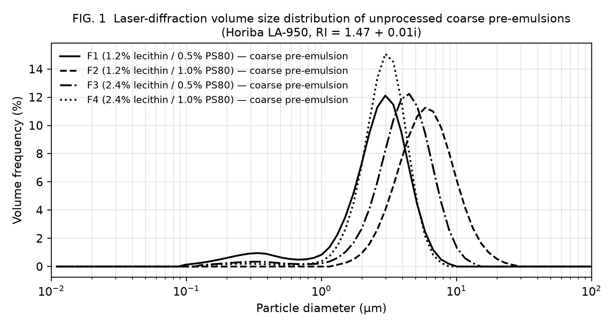

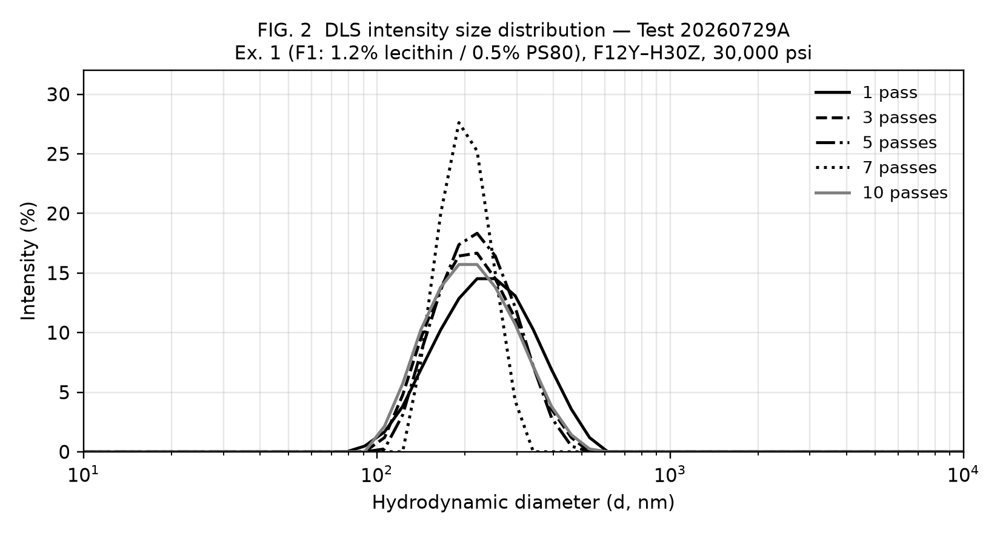

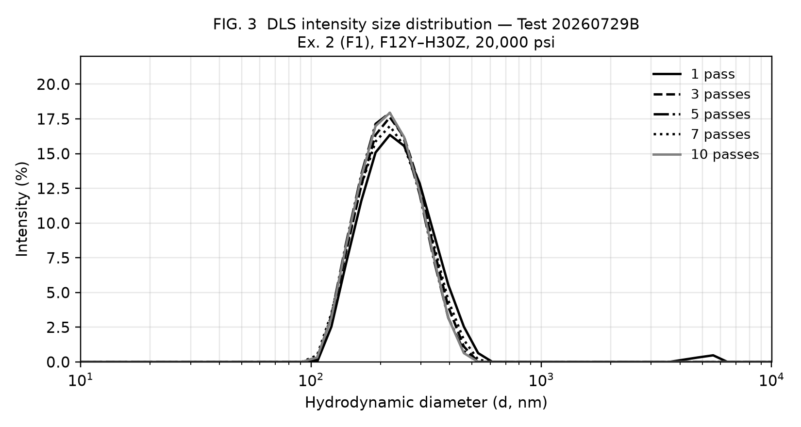

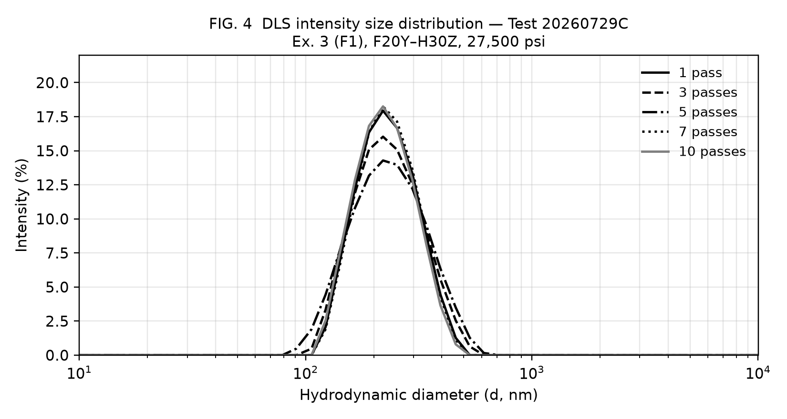

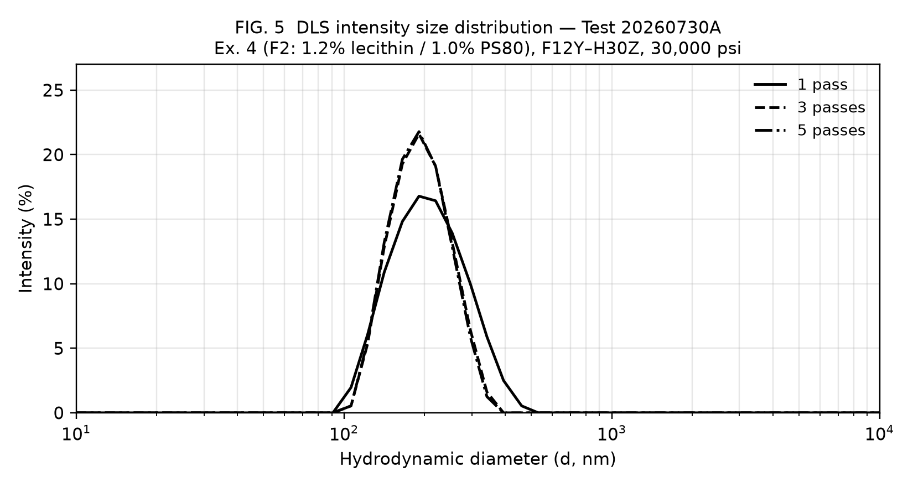

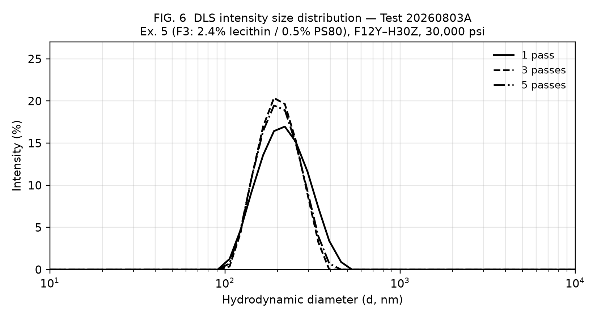

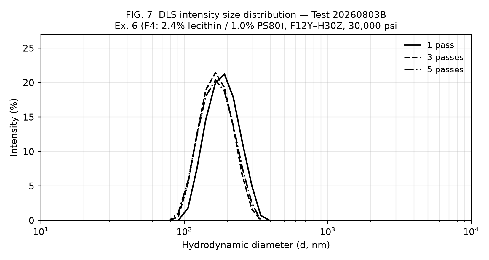

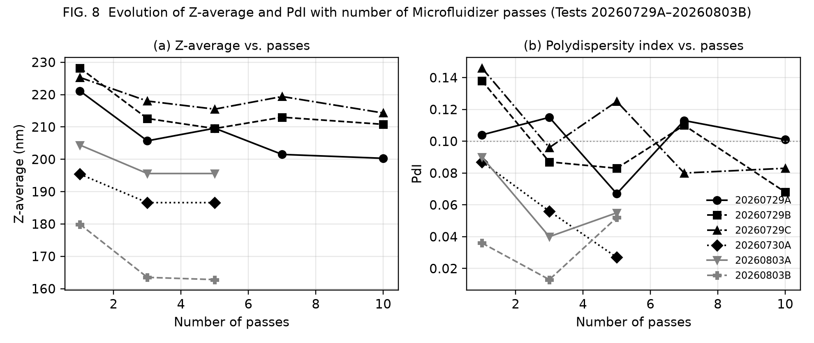

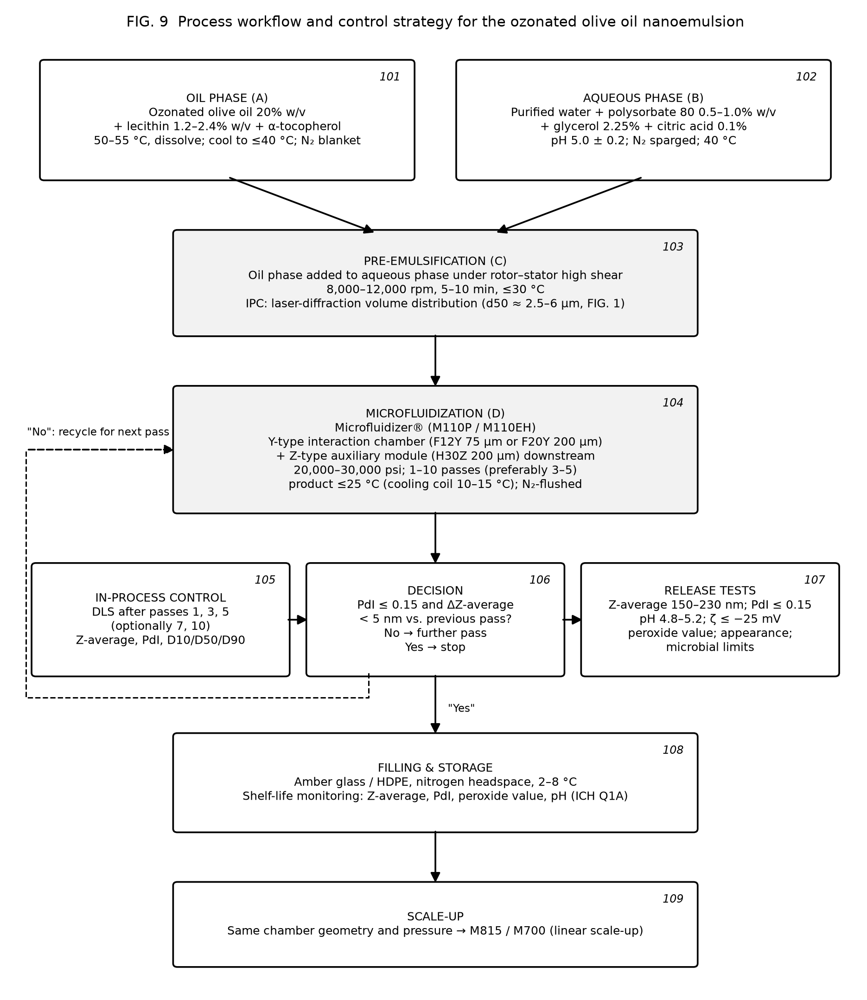

<<<PAGEBREAK>>>

# ANNEX A — PRIOR ART SIMILARITY ASSESSMENT (NOT PART OF THE APPLICATION)

This annex records the preliminary search carried out while drafting. It is a drafting aid for the attorney and is not to be filed. Search tools: web search of patent abstracts (Google Patents result snippets), PubMed/PMC (full text where open access). Full-text patent databases (Google Patents, Espacenet, PatentScope, Lens, FreePatentsOnline, Justia, USPTO) could not be opened from the drafting environment because of network restrictions; the characterisation of each patent below is therefore based on published abstracts and search snippets and must be verified against the full documents before filing. A professional novelty search (e.g. by the EPO or a commercial provider) is strongly recommended.

| Reference | What it discloses (per available abstract) | Overlap with present draft | Risk | Distinguishing features of the present invention |
|---|---|---|---|---|
| WO 2019/240713 A2 — Solutions comprising ozonized oil | Aqueous solutions of nano/micron-sized ozonized oil with at least one emulsifier; lists lecithin and polysorbate 80 among emulsifiers; mentions HPH, microfluidization and ultrasound; uses incl. food supplement, mouthwash, IV | High: same field, same emulsifier names, same process family, oral/food use | **High** — closest art; may anticipate broad composition claims if its examples contain lecithin + PS80 with ozonated olive oil at similar ratios | Defined lecithin:PS80 ratio (1:1–5:1), total surfactant ≤ 4% at 20% oil (SOR 7–20%), Y-type + Z-type chamber train, 20–30 kpsi, ≤ 5 passes, ≤ 25 °C, Z-avg 150–230 nm with PdI ≤ 0.15, D90 ≤ 400 nm; experimental proof of 3-pass plateau. Obtain full text urgently. |
| US 2019/0201338 A1 — Compositions for nanoemulsion delivery systems | Nanoemulsions with lecithin + polysorbate 80, HPH 5,000–30,000 psi, 5–70 °C; ~47 nm droplets | Medium: same surfactant pair and pressure range, generic oils | Medium — relevant to inventive step of composition and process claims | Ozonated oil (not disclosed); thermolability constraint (≤ 25 °C, ≤ 60 °C dissolution); 20% oil load; Y+Z chamber train; specific attribute window |
| EP 2 222 340 B1 — Nanoemulsions | Nanoemulsions < 100 nm from various oils incl. olive oil; lecithin and PS80 formulations | Medium: generic composition overlap | Medium | Ozonated oil; droplet size 150–230 nm (outside its < 100 nm scope); process window |
| WO 98/47464 A1 / US 5,994,414 — Water-thin emulsion by HPH | HPH at 900–1,100 bar, ~0.1 µm droplets | Low–medium: process genus | Low | Ozonated oil, surfactant system, pressure 1,380–2,070 bar, chamber geometry |
| KR 10-1638688 B1 — O/W nanoemulsion method | Generic O/W nanoemulsion preparation | Low | Low | As above |
| GB 2 431 581 A — Ozonated oil formulations | Olive oil ozonated to saturation; pharmaceutical/cosmetic formulations | Medium: same active | Low–medium | No nanoemulsion, no lecithin/PS80, no microfluidization |
| EP 2 025 740 A1 — Ozonised olive oil gel | ≥ 17 g O3 / 100 g EVOO (free oleic acid ≤ 0.8%); gel | Low: active only | Low | Anhydrous gel vs. O/W nanoemulsion |
| WO 2019/102387 A1 / US 11,236,289 B2 — Production of ozonized olive oil | Controlled-degree ozonation method | Low: raw-material process | Low | Downstream formulation; may be cited as source of the oil |
| US 2006/0074129 A1 — Ozonation in W/O emulsion | Ozonates a W/O emulsion (1–50% water) | Low–medium: emulsion + ozone, but W/O and ozonation step | Low | O/W, ozonation precedes emulsification, nanometric |
| DE 20 2004 021 089 U1 — Ozone-stabilised olive/castor oil | 5–25 vol% non-ozonated oil added; homogenised under pressure | Low–medium: "homogenisation under pressure" of ozonated oil | Low | No aqueous phase/emulsifier disclosed per abstract; verify |
| KR 2017/0057515 A — Ozonated olive cream with micro ozone bubbles | Cream (coarse emulsion) | Low | Low | Nanoemulsion, surfactant system, process |
| US 9,554,973 B2 — Micro-encapsulation of ozonated oils | Avocado ozonated oil in polysaccharide emulsion, jet-formed, freeze-dried; notes ozonide degradation in water | Low: teaches away from aqueous emulsions | Low (supports inventive step) | Stable liquid aqueous nanoemulsion contrary to the teaching |
| WO 2020/070623 A1 / IT 2018/00009063 / BR 11 2021 005972 — Ozonised oil on silica for tumours | Silica-adsorbed ozonised oil for water dispersibility | Low: different carrier | Low | Liquid nanoemulsion |
| IT 2016/00078872 A1 (FB Vision) — ozonated sunflower oil; Ozodrop® liposomal eye drops (0.5% oil, soy phospholipids) | Liposomal ozonated sunflower oil, ophthalmic | Medium: phospholipid carrier of ozonated oil | Low–medium | Nanoemulsion (not liposome), 20% vs 0.5% oil, PS80 co-surfactant, microfluidization |
| Carocci et al. patent (cited in Molecules 2020 review) — cationic microemulsion of ozonated sunflower oil | Microemulsion with quaternary ammonium coating and PEG-30 dipolyhydroxystearate | Low–medium | Low | Anionic/non-ionic food-grade system; nanoemulsion |
| Zhou (cited in Molecules 2020 review) — dual-continuous-phase ozonated oil emulsion | 0.1–30 g ozonated oil with 20–50 g emulsifier per 100 g | Medium: oil range overlaps | Low–medium | Surfactant ≤ 4% vs ≥ 20%; nanometric; process |
| Molecules 2020, 25, 334 (review; doi:10.3390/molecules25020334) incl. EIP nanoemulsion (Tween 40, SOR 2, 2.5% oil, 212.7 nm) | Review of delivery systems; low-energy ozonated olive oil nanoemulsion | Medium: nanoemulsion of ozonated olive oil of similar size | Medium for novelty of very broad claims; low for claimed composition | 20% vs 2.5% oil; SOR 0.07–0.20 vs 2; lecithin/PS80 vs Tween 40; high-pressure vs low-energy; PdI ≤ 0.15 |
| Wang et al., Molecules 2026, 31, 3070 (doi:10.3390/molecules31173070) — Nano-Ozo | 1% ozonated oil + 3.5% IPM, 22% Tween 80, 7% PEG-400; ultrasound; 98 nm; +53 mV | Medium: ozonated oil nanoemulsion with Tween 80 | Low–medium | 20× oil load, 6–7× lower surfactant, lecithin, negative zeta, microfluidization, no IPM/PEG |
| BioNanoScience 2026 (doi:10.1007/s12668-026-02532-6) — ozonated castor/olive/sunflower nanoemulsions | Ultrasonicated; 82–118 nm; PdI 0.21–0.36 | Medium | Low–medium | PdI ≤ 0.15; high-pressure process; defined food-grade system (verify their surfactants) |
| Yalçın et al., BBRC 2022, 615, 143 (doi:10.1016/j.bbrc.2022.05.030) — OZNE radiosensitiser | Ultrasonicated ozonized oil nanoemulsions | Low–medium | Low | As above |
| J. Res. Pharm. (dergipark) — ozonated olive oil nanoemulsions by ultrasonication with glycerol; negative zeta; PdI < 0.5 | Ultrasonic nanoemulsions | Medium (glycerol, negative zeta) | Low–medium | Verify surfactants; present invention uses high-pressure microfluidization, PdI ≤ 0.15 |
| Antioxidants 2022, 11, 1318 (doi:10.3390/antiox11071318) — niosomal ozonated olive oil | Cholesterol/Span 60/Tween 60 niosomes, 125 nm | Low | Low | Different carrier |
| Innov. Food Sci. Emerg. Technol. 2022 (pii S1466856422002661) — chitosan nano/microcapsules of ozonated olive oil | Encapsulation in chitosan films | Low | Low | Different carrier |
| Petrovici et al., Sci. Rep. 2026, 16, 6931 (doi:10.1038/s41598-026-38169-4) — ozonated high-oleic sunflower oil and 1:9 water:oil emulsion | Ozonation of a W/O emulsion; stability data | Low | Low | O/W nanoemulsion of pre-ozonated oil |

**Overall assessment.** No reference identified discloses the claimed combination of (i) about 20% w/v ozonated olive oil, (ii) a lecithin–polysorbate 80 binary system at a 1:1–5:1 ratio and ≤ 4% total, and (iii) a Y-type/Z-type microfluidization process at 20–30 kpsi with ≤ 5 passes at ≤ 25 °C, giving Z-average 150–230 nm and PdI ≤ 0.15. The principal novelty risk is WO 2019/240713 A2, whose full claims and examples must be read; if that document exemplifies lecithin + polysorbate 80 with ozonated olive oil, the independent claims should be narrowed toward the ratio, SOR, PdI and process features and the 3-pass plateau effect. Inventive-step arguments available: US 9,554,973 teaches away from aqueous emulsions of ozonated oils; prior nanoemulsions of ozonated oils required surfactant-to-oil ratios ≥ 2 and oil loads ≤ 2.5%, whereas the invention achieves 20% oil at SOR 0.085–0.17 with PdI as low as 0.013; the unexpected plateau after three passes permits a mild process compatible with ozonide preservation. Supporting stability and ozonide-retention data (paragraph [0058]) would materially strengthen the case.

**Search strategy used.** Queries: "ozonated olive oil nanoemulsion patent"; "ozonated oil nanoemulsion lecithin polysorbate 80 high pressure homogenization WO"; "patent ozonated oil emulsion oral food supplement water dispersible"; "Erbagil Ozoil patent"; "ozonized OR ozonated oil nanoemulsion zeta potential polydispersity 2023–2026"; PubMed: "ozonated oil nanoemulsion"; "(ozonated olive oil OR ozonated sunflower oil OR ozonized oil) AND (emulsion OR nanoemulsion OR liposome OR microfluidizer OR high pressure homogenization)" (47 hits, 20 screened). Recommended additional classes for the professional search: CPC A61K 9/107, A61K 9/1075, A61K 47/24, A61K 47/26, A61K 36/63, A61K 33/40, A23L 33/115, A61Q 19/00, B01F 23/41.

<<<PAGEBREAK>>>

# ANNEX B — ORIGINAL INSTRUMENT OUTPUT (DLS), FOR REFERENCE

The six Malvern Zetasizer Nano-S "Size Distribution by Intensity" graphics embedded in the applicant's test workbook were vector metafiles; they were rasterised without modification of the curve data and are reproduced below. Records 1–5: test 20260729A (FIG. 2); Records 6–10: 20260729B (FIG. 3); Records 11–15: 20260729C (FIG. 4); Records 16–18: 20260730A (FIG. 5); Records 19–21: 20260803A (FIG. 6); Records 22–24: 20260803B (FIG. 7).

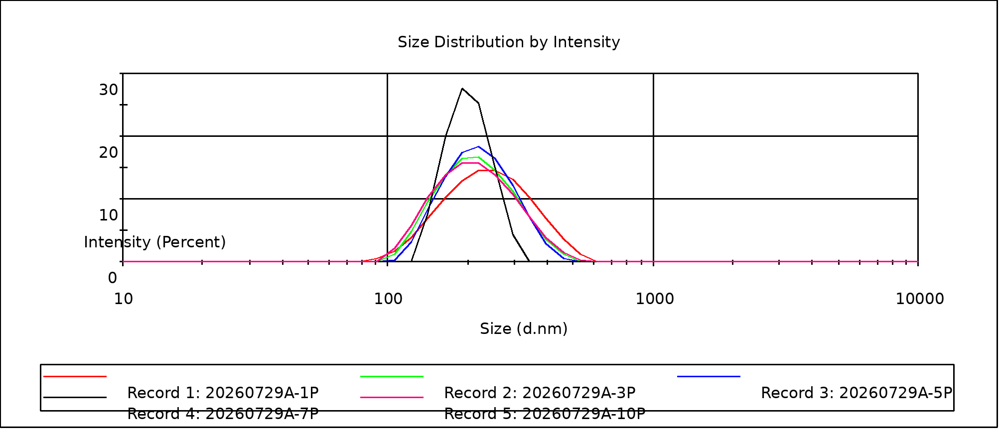

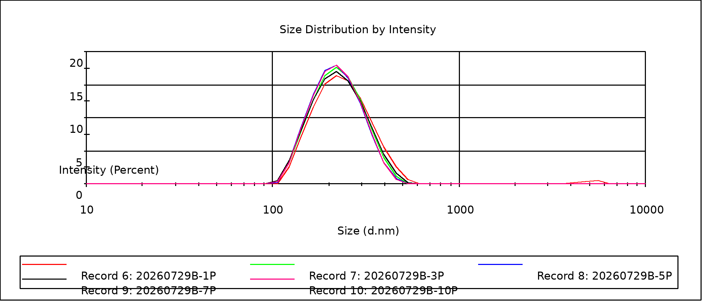

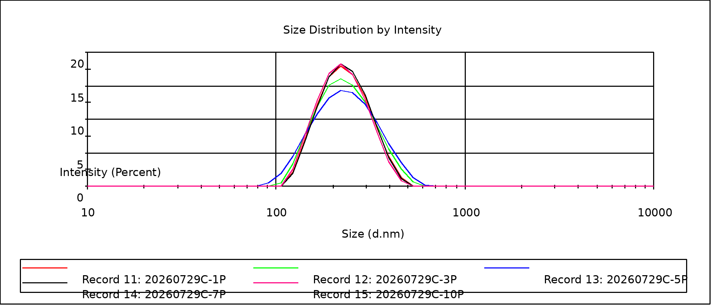

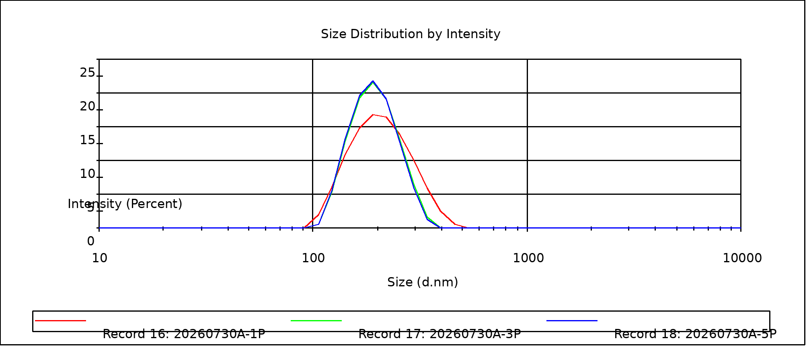

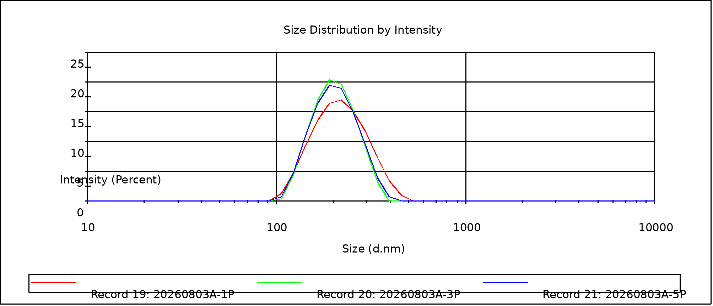

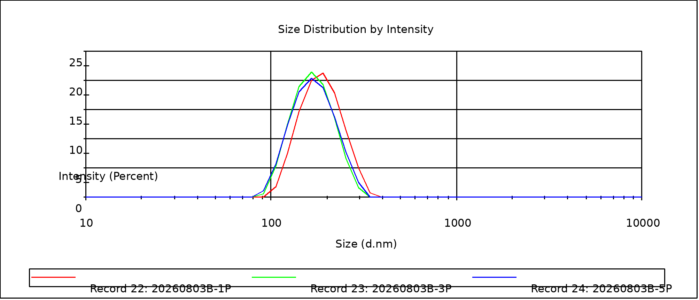
